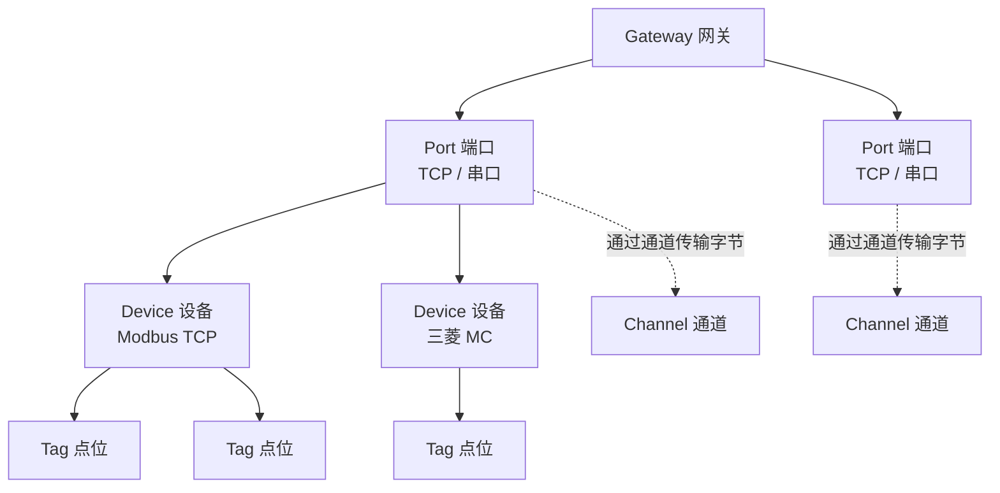
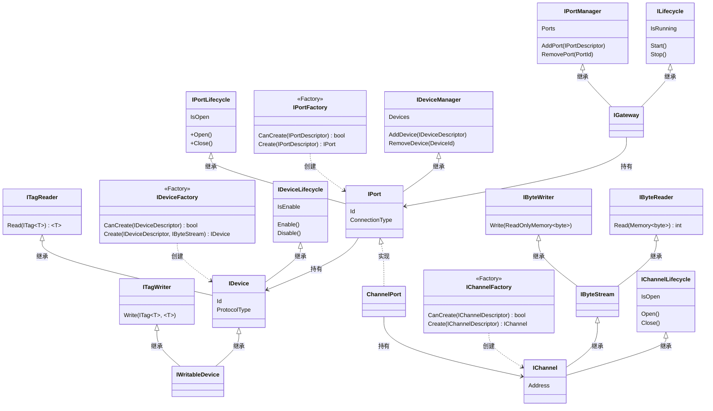

# EdgeGateway (边缘网关)

解决plc数据点位多, 连接方式复杂的问题。

## 设计理念

核心目标是把物理连接、协议解析、数据点位三层解耦，让新增一种 PLC 协议、新增一路连接、新增一批点位时，互不牵连。

```mermaid
graph TD
    GW[Gateway 网关] --> P1[Port 端口<br/>TCP / 串口]
    GW --> P2[Port 端口<br/>TCP / 串口]

    P1 --> D1[Device 设备<br/>Modbus TCP]
    P1 --> D2[Device 设备<br/>三菱 MC]

    D1 --> T1[Tag 点位]
    D1 --> T2[Tag 点位]
    D2 --> T3[Tag 点位]

    P1 -. 通过通道传输字节 .-> C1[Channel 通道]
    P2 -. 通过通道传输字节 .-> C2[Channel 通道]
```

## 接口分层与依赖关系

```mermaid
classDiagram
    
    class ILifecycle {
        IsRunning
        Start()
        Stop()
    }

    class IPortManager {
        Ports
        AddPort(IPortDescriptor)
        RemovePort(PortId)
    }

    class IGateway


    

    class IPortFactory {
        <<Factory>>
        CanCreate(IPortDescriptor) bool
        Create(IPortDescriptor) IPort
    }

    class IPortLifecycle {
        IsOpen
        +Open()
        +Close()
    }

    class IPort {
        Id
        ConnectionType
    }

    
    class IDeviceLifecycle {
        IsEnable
        Enable()
        Disable()
    }

    class IDevice {
        Id
        ProtocolType
    }

    class IDeviceManager {
        Devices
        AddDevice(IDeviceDescriptor)
        RemoveDevice(DeviceId)
    }

    class IDeviceFactory {
        <<Factory>>
        CanCreate(IDeviceDescriptor) bool
        Create(IDeviceDescriptor, IByteStream) IDevice
    }

    class ITagReader {
        Read(ITag~T~) ~T~
    }

    class ITagWriter {
        Write(ITag~T~, ~T~)
    }

    class IByteReader {
        Read(Memory~byte~) int
    }
    class IByteWriter {
        Write(ReadOnlyMemory~byte~)
    }
    class IByteStream


    class IChannelLifecycle {
        IsOpen
        Open()
        Close()
    }
    class IChannelFactory {
         <<Factory>>
        CanCreate(IChannelDescriptor) bool
        Create(IChannelDescriptor) IChannel
    }

    class IChannel {
        Address
    }
    class ChannelPort


    ILifecycle <|-- IGateway : 继承
    IPortManager <|-- IGateway : 继承
    IGateway --> IPort : 持有

    IDeviceManager <|-- IPort : 继承
    IPort --> IDevice : 持有 
    IPortFactory ..> IPort : 创建
    IPortLifecycle <|-- IPort : 继承
    
    IDeviceLifecycle <|-- IDevice : 继承
    IDeviceFactory ..> IDevice : 创建
    ITagReader <|-- IDevice : 继承

    IDevice <|-- IWritableDevice : 继承
    ITagWriter <|-- IWritableDevice : 继承

    IByteReader <|-- IByteStream : 继承
    IByteWriter <|-- IByteStream : 继承

    IChannelLifecycle <|-- IChannel : 继承
    IByteStream <|-- IChannel : 继承
    IChannelFactory ..> IChannel : 创建

    IPort <|.. ChannelPort : 实现
    ChannelPort --> IChannel : 持有 
```